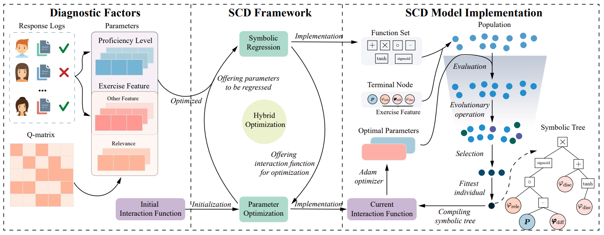

# SymbolicCDM

This repository contains the code for the paper "Symbolic Cognitive Diagnosis via Hybrid Optimization for Intelligent Education Systems" 
published in _proceedings of the 38th AAAI Conference on Artificial Intelligence_. 

Besides, we also upload the main paper and its appendix, titled `main.pdf` and `appendix.pdf` respectively in the folder named paper.



**Should you have any questions, add issues in this repository. We will try our best to address your concerns.**

## Requirements
Create the running environment with conda `4.10.3` with Python `3.9.0`:
```
conda create -n pedbo python==3.9
conda activate pedbo
```

Install all necessary packages:
```
pip install -r requirements.txt
```

## Reproducing
### Run `example.py`
We have prepared a sample datasets FracSub to demonstrate the SCD framework. Having installed
all necessary packages, you can run `example.py` using
```
python example.py
```

### Run with other datasets
#### Step 1. prepare dataset


## File Tree
```
SymbolicCDM:
│  example.py
│  LICENSE
│  README.md
│  requirements.txt   
│      
├─asset
│      img.png        
│      
├─dataset
│  └─FracSub
│          config.json
│          data.csv   
│          q.csv
│
├─paper
│      appendix.pdf
│      main.pdf
│
└─SCDM
      eval.py
      interaction.py
      model.py
      operators.py
      parameter.py
      utility.py
      __init__.py

```

## Citation

```
@inproceedings{shen2024symbolic,
 author = {Shen, Junhao and 
           Qian, Hong and 
           Zhang, Wei and 
           Zhou, Aimin},
 booktitle = {Proceedings of the 38th AAAI Conference on Artificial Intelligence},
 title = {Symbolic Cognitive Diagnosis via Hybrid Optimization for Intelligent Education Systems},
 year = {2024},
 address = {Vancouver, Canada},
 page = {}
}
```
